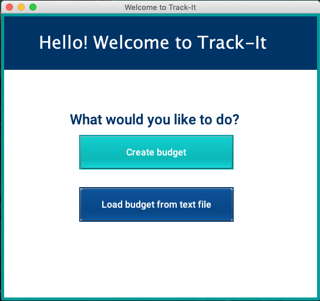
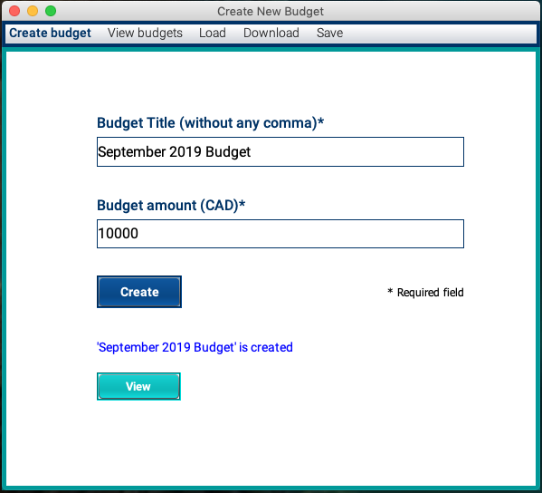
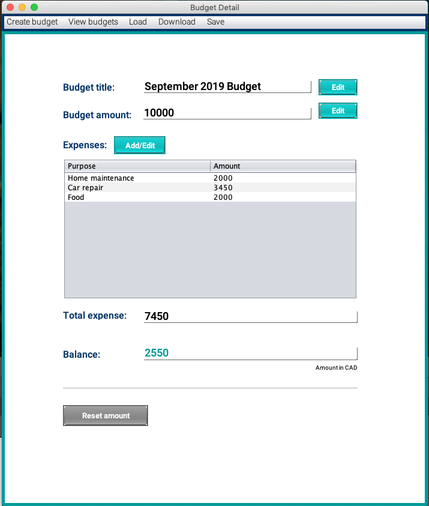
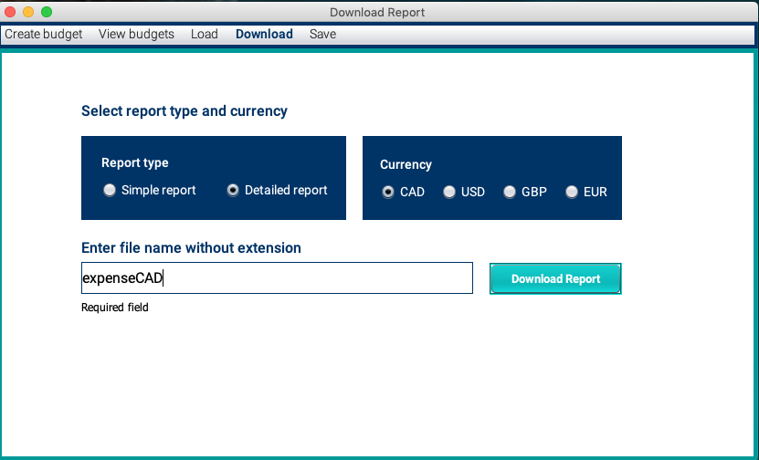

# Track-It Application
Track-It is a Java expense tracker app that was built with object-oriented design principles. 

It allows users to set budgets, add expenses and view balances. With Observer pattern, balances are re-calculated every time budget or expense amounts are updated. Users can also create multiple budgets. When they add expenses, they can choose which budget the expenses are deducted from. 

They can also save their record and load it back when they want to resume their tracking. In addition, they can also download reports in text format.  

Web API is used for obtaining currency exchange rate from the website. Users can view balance or download report in CAD, USD, GBP or EUR. 

Simple graphical user interface (GUI) was created by Swing to allow user to use the app easily.

Exception handling and unit testing was implemented to increase the robustness of the app.

 

 

 

 

